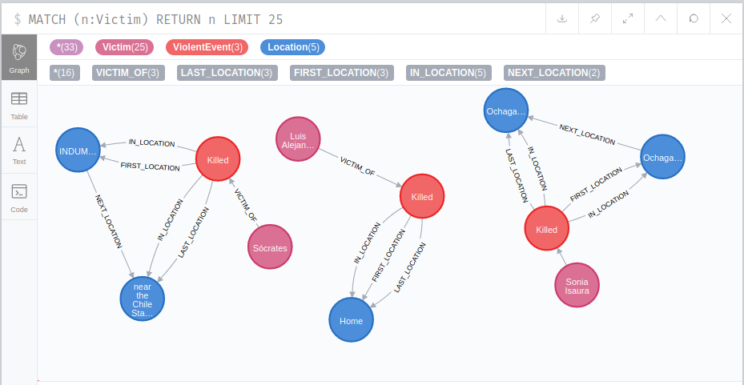

# pinochet-analyze

A repository for exploring the pinochet dataset [freire2019pinochet] and hopefully more data. Read more about this dataset in <https://github.com/danilofreire/pinochet>.

## Getting started

### Launching all services

1. install docker and docker-compose
2. `docker-compose up -d`, wait until it finishes

### Browsing the neo4j graph

1. `make neo4j.db.recreate` and wait until it finishes
2. browse the graph using the `neo4j` service at <http://0.0.0.0:7474/browser/>

The graph _schema_ or shape is

### Browsing the graphQL endpoint (WIP)

Endpoint is available at <http://localhost:5000/graphql>

### Browsing the leaflet map (WIP)

Go to <http://localhost:8080/>

Note that this map is not consuming the graphql schema yet.
